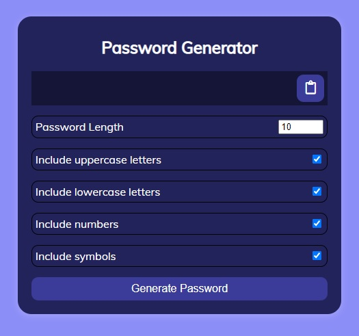

# PasswordGeneratorApp

## Demo

[**click live demo of the project**](https://dominiksiejka.github.io/PasswordGeneratorApp)



## Table of Contents

- [About the Project](#description)
- [How to use](#how-to-use)
- [Technologies used](#built-with)
- [Setup steps](#setup)
- [Sources](#sources)
- [License](#license)

## Description

PasswordGeneratorApp it helps you to generate the password according to choosen requirements. You can adjust it to your needs and then copy it to clipboard.

## How to use

Change the password length, and tick the chexcboxes with different requirements in order to include them in generated password. Then click on the botton to copy the password. By deafult all vields are checked.

## Built with

- HTML5
- CSS
- Vanilla JavaScript

## Setup

```
with BASH

# clone the remote repo to your local one
$ git clone https://github.com/dominiksiejka/PasswordGeneratorApp.git

# open the index.html file or use your code editor to open it with live server

```

## Sources

- Icons from [Font Awesome ](https://fontawesome.com)
- Font from [Google Fonts ](https://fonts.google.com/)

## License

- MIT © [Dominik Siejka ](https://github.com/dominiksiejka/PasswordGeneratorApp)
